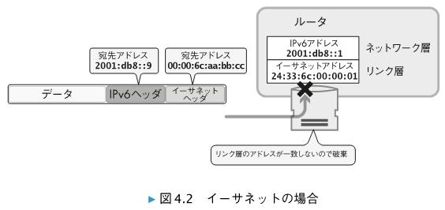
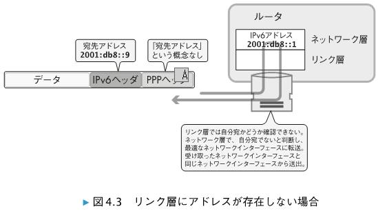
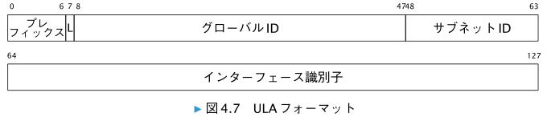
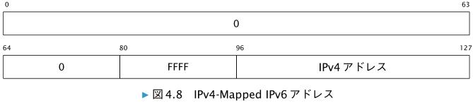
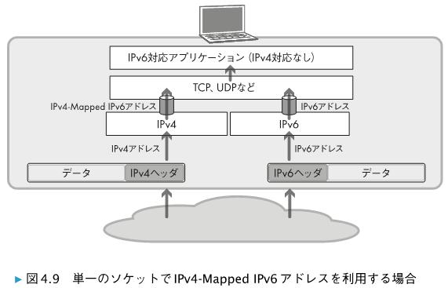

# 4.1　IPv6アドレスの種類

| アドレス種類 | Ipv6 アドレス |
| --- | --- |
| 未定義アドレス | ::/128 |
| ループバック | ::1/28 |
| マルチキャスト | ff00::/8 |
| リンクローカルユニキャスト | fe80::/10 |
| ULA | fc00::/7 |

* 未定義アドレスは、IPv6 アドレスの割り当てられる前のノードが送信元として利用します。ただし、送信元 IPv6 アドレスが「 ::/128 」のパケットを
ルータが転送することは禁止されています。

* 現時点で、fc00::/8 は未定義であり、ローカル利用の ULA は fd00::/8 となっている。 
ULA のスコープ（ 4.4 節）は、グローバル IPv6 アドレス同様にグローバルスコープです。**ただし、グローバルな IPv6 インターネットで ULA の
経路が広告されることは想定されていません（禁止されているわけでもないので注意してください）。**

* グローバルユニキャストアドレスは、現状 2000::/3 となっている。

> NOTE  
> ルーティングプロトコルでデフォルト経路を表現するために利用されるのは、 IPv6 では「 ::/0 」 、 IPv4 では「 0.0.0.0/0 」です。それぞれプレフィックス長が 0 です。

* よく使われるマルチキャストアドレス  
　同一リンク内の全ノード　ff02::1  
　同一リンク内の全ルータ　ff02::2

# 4.2　IPv6 アドレス空間の使い方は IANA が管理している

# 4.3　IPv6 におけるユニキャストアドレスの構成要素

# 4.4　IPv6 アドレスのスコープ
　IPv6 には、 IPv6 アドレスの有効範囲を示すスコープという概念があります。 IPv6 アドレス
のスコープは RFC 4007 で定義されており、ユニキャストおよびエニーキャストアドレスに
はリンクローカルスコープとグローバルスコープの 2 種類があります。

　スコープには、スコープに対するゾーンという考え方があります。ゾーンについては 4.7 節で
解説します。

# 4.5　IPv6 ノードに要求される IPv6 アドレス
　IPv6 対応しているホストに設定が必要、もしくは対応が求められる IPv6 アドレスには以下
のような種類があります。

* 各ネットワークインターフェースごとにリンクローカルアドレス（ 4.6 節参照）が必要
* ネットワークインターフェースに対するユニキャストまたはエニーキャストアドレス
* ループバックアドレス（ ::1/128 ）
* 全ノードマルチキャストアドレス（ ff02::1 ）
* 各ユニキャストおよびエニーキャストアドレスに対応する Solicited-Node マルチキャストアドレス（ 12.3 節参照）
* そのノードが参加する、その他マルチキャストアドレス（第 12 章参照）

IPv6 対応しているルータでは、上記の IPv6 アドレスに加えて、以下の IPv6 アドレスにも対応が必要です。

* ルータとしての機能を提供しているネットワークインターフェースに対するサブネットルータエニーキャストアドレス（ 13.3 節参照）
* ルータに対して設定されるその他のエニーキャストアドレス（第 13 章参照）
* 全ルータマルチキャストアドレス（ ff02::2 ）

# 4.5.1　ルータ同士を /127 で接続する際の注意

　/127 とすると、IPv6 アドレスがネットワークで 2 つのみ存在できる状態になります。このような運用には、自分の
IP アドレスがわかれば自動的に相手の IP アドレスもわかるという利便性があるほか、リンク層
アドレスがない Point-to-Point なリンク上でのパケットのピンポン状態を防げるというメリッ
トがあります。たとえば、PPP や IPv6 over IPv4 トンネルなどではリンク層のアドレスがあり
ません。そのため、受け取ったパケットが自分宛ではないかどうかをリンク層アドレスで判断
できません。 /127 よりも短いプレフィックス長を利用すると、 Point-to-Point リンクの両端に
接続された機器の IP アドレスではない IP アドレスを宛先とするパケットが、ピンポンのよう
にリンク上を行き来してしまう可能性があるのです。

　以下では、プレフィックス長が /64 とします。

　イーサネットのようにリンク層アドレスがあれば、リンク層において自分宛ではないパケッ
トを判別可能であり、そのようなパケットをネットワーク層へと渡す前に破棄できます。イー
サネットでは、同一リンク上に存在する可能性がある他の機器宛のパケットを拾ってルータが
転送してしまうことは、通常はありません。図 4.2 に、リンク層がイーサネットの場合の例を
示します。

　図 4.3 に、リンク層アドレスがないプロトコルで、宛先 IPv6 アドレスがルータのネットワー
クインターフェースとは異なり、かつ、同じネットワークプレフィックスに属する宛先 IPv6
アドレスに対するパケットを受け取った状況の例を示します。

　図 4.3 では、受信したデータが自分宛かどうかをリンク層では確認できないので、パケット
がそのままネットワーク層へと渡されます。ネットワーク層では、そのパケットの宛先が自分
ではないので、ルータとして転送を試みます。

　パケットの宛先が、リンクの両端に付いている IPv6 アドレスのいずれでもない場合、リン
クの両端にあるルータがまったく同じ挙動を示す可能性があります。その結果、IPv6 ヘッダ
のホップリミットが 0 になるまでパケットが Point-to-Point リンク上を転送され続けてしまう
「ピンポン状態」が発生してしまいます。

　IPv4 では /31 がよく利用されている一方で、 IPv6 では、ルータ同士の接続で /127 を利用
するのは避けるべきであるという RFC 3627 が 2003 年に発行されました。 RFC 3627 は
Informational な RFC であり標準ではありませんが、 RFC 化されていることもありそれなりに
大きな影響力を持っていました。

　RFC 3627 において、ルータ同士の接続で /127 を利用すべきでないとされている理由は、 2
つしかない IPv6 アドレスを両方とも片方のルータが利用してしまう可能性があるからです。

　この状況が起きる背景には、第 8 章で説明する IPv6 アドレス自動生成の仕組みと、サブネッ
トに接続されたルータのネットワークインターフェースに設定されるサブネットルータエニー
キャストアドレス（ 13.3 節参照）の存在があります。ここでは簡単に問題が起こる状況を説明
しておきます。

　たとえば、 /127 のセグメントで片方のルータが通常のユニキャスト IPv6 アドレスを自動生
成し、 2 つある IPv6 アドレスのうちの片方を利用することにしたとします。いま、もう片方の
ルータでは IPv6 アドレスが設定されていないとすると、最初のルータにおける重複アドレスの
検知（ 8.5 節で説明する DAD ）は成功し、ネットワークインターフェースにそのアドレスが設
定されます。このルータで、さらにサブネットルータエニーキャストアドレスを設定すると、
2 つある IPv6 アドレスのうちの両方が片方のルータに利用されることになります。この状況
で、もう片方のルータにおいて IPv6 アドレス自動生成を実行すると、 DAD に失敗することに
なります。結果として、そのルータでは、 /127 のセグメントのネットワークインターフェー
スに IPv6 アドレスが付きません。

　このような問題を避けつつ、ルータ同士が /127 を利用できるようにするため、 2011 年に
RFC 6164 が発行されました。 RFC 6164 では、ルータ同士の接続において /127 を利用する
際にサブネットルータエニーキャストアドレスを利用することを禁止しています。また、 /127
を利用する際に後半 64 ビットがすべて 0 となる IPv6 アドレスを利用することや、後半 64 ビッ
トの上位 128 個の範囲（ ffff:ffff:ffff:ff7f ～ ffff:ffff:ffff:ffff ）を利用すること
も禁止しています。

　RFC 3627 は Informational な RFC でしたが、 RFC 6164 は Standards Track の RFC です。
RFC 6164 のほうが重要視される分類ですが、それをより明確にするために、 2012 年に RFC
3627 を廃止（ Historic Status ）する RFC 6547 が発行されました。したがって、現在では、
ルータ同士の接続において /127 というプレフィックス長を使うことを妨げる RFC は存在しな
いことになります

# 4.6　リンクローカルユニキャストアドレス（fe80::/10）

　リンクローカルユニキャストアドレスは、同一リンク内でのみ利用可能なリンクローカルス
コープの IPv6 アドレスです。 IPv6 アドレスを自動設定する機能（第 8 章）でも利用され、 IPv6
を構成する重要な要素の 1 つといえます。すべてのネットワークインターフェースには、リン
クローカルユニキャストアドレスを設定する必要があります

　fe80::/10 として、リンクローカルアドレスを生成するとあります。このときのインターフェース識別子の長さは、 RFC 4862 では任意とされています。

> しかし、現在の実装はインターフェイス識別子が 64bits になっているのが現状。（RFC4291）

> NOTE  
> 本書では、 fe80::0/64 のリンクローカルユニキャストアドレスを「リンクローカル
アドレス」と表現することがあります。 ff02::1 などのリンクローカルスコープのマル
チキャストアドレスに関しては、 「リンクローカルマルチキャストアドレス」と表現し
ます。

# 4.7　スコープのゾーン

　スコープがアドレス体系から決まるのに対し、ゾーンは個々のリンクを構成するインター
フェースなどで決まります。どのようにしてゾーンが決まるかは、スコープごとに次のように
整理できます。

* インターフェースローカルスコープに対しては、ノード内の各インターフェースによっ
て、 1 つのゾーンが形成される（ただしマルチキャストの場合のみ）

* リンクローカルスコープに対しては、あるリンクとそのリンクに接続されたインター
フェースによって、 1 つのゾーンが形成される（ユニキャスト、エニーキャスト、マルチ
キャストの場合）

* グローバルスコープに対しては、インターネットに接続されたすべてのリンクとネット
ワークインターフェースによって、 1 つのゾーンが形成される

* 上記以外のスコープについては、ネットワーク管理者によってゾーンが定義され、設定さ
れる

　同じスコープに対応するゾーンがオーバーラップすることはありません。あるインター
フェースが属するゾーンは、同じスコープに対するものであれば、必ず 1 つだけです。スコー
プが異なれば、複数のゾーンに同じインターフェースが属することはあります。たとえば、す
べてのインターフェースはリンクローカルなゾーンに属すると同時にグローバルなゾーンにも
属しています。実際、小さいスコープに対応するゾーンは、より大きなスコープに対応する
ゾーンに完全に内包されます。

　IPv6 では、ゾーン内のパケットがゾーン外に転送されることが禁止されています。ゾーン
が示す宛先に向かうパケットは、そのゾーンから抜け出すことができません。

　ユニキャストとエニーキャストに必要なゾーンは、リンクローカルスコープに対応するもの
と、グローバルスコープに対応するものの、 2 つだけです。一方、マルチキャストでは多様な
ゾーンが必要になります。マルチキャストにおけるゾーンに関しては、 12.4 節で解説します。

# 4.7.1　ゾーンインデックス

　あるインターフェースにおけるグローバルスコープ以外のアドレスがどのゾーン
に属するものかをノード内で識別するために、ゾーンインデックス（ゾーン ID ）という仕組み
が使われます。

　ゾーンインデックスをどのように表現するかは RFC 4007 では規定されておらず、
実装により異なっています。 BSD の実装ではリンクとインターフェースが 1 対 1 だと仮定して
おり、結局のところ一意性も保証されることから、実装の都合上の簡易記法としてインター
フェースの番号をリンクにおけるゾーンインデックスとして使う実装がしばしば見られます。
eth0 といったネットワークインターフェースの「名前」をゾーンインデックスに利用する
実装もあります。その場合、いまの例は fe80::1%eth0 のように表現されます

**■ URI にゾーンインデックスが含まれる場合の表記**

　RFC 4007 では、ゾーン ID と IPv6 アドレスを組み合わせて表現する際のフォーマットを
「 address%zone_id 」としています。RFC 3986 で定義されている URI 構文では、 「 % 」という文字がエスケープ対象であるため、
IPv6 アドレスのゾーンインデックスを示すために URI 中に「 % 」をそのまま使うことが URI
構文の仕様と競合します。 RFC 6874 では、ゾーン ID と IPv6 アドレスの間にある % に対して
Percent-Encoding を行った値ですが %25 を利用することを定義しています。これにより、た
とえば、 fe80::a%eth0 を含む URL の表現は、以下のようになります。
  
　http://\[fe80::a%25eth0\]

> NOTE  
> RFC 6874 では、 URI 中では「 %25 」を使うことを必須としていますが、過去の実装では
「 % 」を扱っていたものもあり、すべての実装が「 %25 」ではない可能性もあります。他
の RFC 同様に、 RFC で標準仕様とされていることが必ずしもすべて仕様どおりに実装さ
れているとは限らないという点に注意が必要です。

# 4.8　グローバルユニキャストアドレス

　RFC 4291 の 2.5.1 項では、最初の 3 ビットが 000 で開始するものを除く IPv6 ユニキャスト
アドレスは、インターフェース識別子を 64 ビット長にすることが要求されています。そのた
め、たとえばグローバルルーティングプレフィックスが 32 ビットであった場合、各家庭への
サブネット ID として残りの 32 ビットを利用し、家庭内での個別機器識別のためのインター
フェース識別子用に残りの 64 ビットを利用するという運用が一般的です。

# 4.8.1　IPv6 アドレスの /64 境界について

　IPv6 の基本仕様は IPv6 アドレスの 128 ビットをサブネットプレフィックスとインター
フェース識別子に分ける際の境界について明記していません。しかし、 IPv6 アドレス体系の
仕様である RFC 4291 では、先頭 3 ビットが 000 で開始するものを除くすべてのユニキャス
ト IPv6 アドレスのインターフェース識別子は 64 ビット長であるとしています。ただし、 IPv6
アドレスのサブネットプレフィックス境界を /64 としない RFC での唯一の例外として、 RFC
6164 にある /127 を使う場合があります（ 4.5.1 項参照） 。

　RFC 7421 によると、 /64 境界は、 IPv6 の初期デザインの時点で議論されていたとあります。
その後、 /80 を境界とするという案があったものの、 48 ビット長の MAC アドレスを置き換え
る形で EUI-64 の MAC アドレスの利用が普及するだろうと当時は予想されていたこともあり、
/64 境界でのインターフェース識別子がデファクトになりました。

　IPv6 の基本仕様は /64 に限定されていないので、 /64 以外のプレフィックス長も利用は可能
です。その一方で、 /64 を強く意識していたり、ある一定のプレフィックス長以上になると対
応できないプロトコルなども存在するので、注意が必要です。

　実装上の問題もあります。 RFC 7421 では、 /80 や /96 などのプレフィックス長で動作でき
る転送機器が存在すると述べられています。しかし、プレフィックス長が 64 を超えると性能
が劣化するルータが存在することも紹介されています。このような性能劣化は、ルータの設計
によるものです。メモリや消費電力の有効利用、索引の速度上昇などを目指すために、 64 ビッ
ト境界を前提とした設計を採用するチップもあるのです。

# 4.9　ULA （ Unique Local IPv6 Unicast Addresses ）

　IPv6 には、 サイト内でのローカルな通信で利用するために、ULA というユニキャスト IPv6 アドレスが用意されています。
ULA は、サイト内でのローカルな通信だけでなく、限定された数のサイト間でのルーティン
グでの利用も想定されています。そのため、 ULA のスコープはグローバルスコープです。
**ただし、グローバルな IPv6 インターネットで ULA の
経路が広告されることは想定されていません（禁止されているわけでもないので注意してくだ
さい）。**

　ULA の先頭 7 ビットは、fc00::/7 です。ビット位置 7 の L は、 1 の場合がローカル、 0 の場合は未定義（ 「将来定義される」 ）となっ
ています。このように RFC に記載されたプロトコルには「将来定義される」とされたフィール
ドが多くあり、いつまでも定義されずにそのままになっていることも少なくありません。本書
執筆時点で ULA として利用される IPv6 アドレスは、事実上は fd00::/8 のみとなります。

　IPv6 アドレスにおけるサブネットプレフィックス（図 4.1 参照）にランダムな値が含まれる
ことも、 ULA の大きな特徴です。図 4.7 で「グローバル ID 」となっている 40 ビットが、疑似
的なランダム値となります。このフィールドでは、既知の数値などを利用して一意性を確保す
ることは禁止されており、 RFC 4086 に基づくランダムな値を生成して利用することが求め
られています。この部分がランダムであることから、 ULA に関連する経路、 DNS 、あるいはパ
ケットが外に漏れたとしても、他のアドレスとの競合が発生しにくいとされています。

　ランダムな 40 ビットのグローバル ID の後ろには、 16 ビットのサブネット ID フィールドが
続きます。

# 4.9.1　グローバル ID のランダム値の生成例

　ULA のグローバル ID フィールドの値を、 RFC 4086 に準拠した疑似ランダ
ムな方式で生成することを求めています。そのうえで、疑似ランダムなグローバル ID の生成
アルゴリズムの例が次のように紹介されています。

* 現在時刻を 64 ビットの NTP フォーマットで取得
* EUI-64 識別子をシステムから取得。 EUI-64 識別子が存在しないシステムであれば、 48
ビットの MAC アドレスから EUI-64 を生成。もし、いずれも作成できない場合には、シ
ステムと関連があり適度な一意性がある識別子を利用する
* 鍵を生成するために現在時刻とシステムに関連する一意性のある識別子を結合する
* 鍵に対して、結果が 160 ビットとなる SHA-1 ダイジェストを計算する
* 160 ビットのうちの下位 40 ビットをグローバル ID として利用する
* プレフィックス（ fc00::/7 ） 、 L ビット（ 1 ） 、上記で用意したグローバル ID の 40 ビッ
トをつなぎ合わせ、 ULA の IPv6 アドレスプレフィックスとする

# 4.10　IPv4-Mapped IPv6 アドレス

　IPv4-Mapped IPv6 アドレスは、 IPv6 パケットの送信元や宛先アドレスとして利用するため
のアドレスではないので、意図せず使ってしまわないように注意が必要です。

> NOTE  
> 紛らわしいかもしれませんが、 RFC 4659 † 15 や RFC 4798 † 16 では、 BGP-MPLS 利用時に、
BGP Next Hop フィールドとして IPv4-Mapped IPv6 アドレスが活用される場合もある
と紹介されています。

　IPv4-Mapped IPv6 アドレスは、 ::ffff:[IPv4 アドレス ] のように表記されることもありま
す。たとえば、 192.0.2.201 という IPv4 アドレスの相手と通信するときに使う IPv4-Mapped
IPv6 アドレスであれば、 ::ffff:192.0.2.201 のように表現されます。

# 4.10.1　ノード内での IPv4-Mapped IPv6 アドレスの扱い

 　IPv6 アプリケーションでは、 IPv4-Mapped IPv6 ア
ドレスを利用することで、図 4.9 のように IPv4 からと IPv6 からの両方の通信を単一のソケッ
トで扱えるようになります。

　**IPv6 アプリケーションがパケットを送信する場合には、 IPv4-Mapped IPv6 アドレスを指
定することで、 IPv4 アドレス宛に送信できます。逆に、 IPv4 から受け取るパケットの送信元
や宛先は、 IPv4-Mapped IPv6 アドレスによって表現できます。アプリケーション内部で利
用する IP アドレスを IPv6 のみに限定する一方で、機器から送出されるパケットについては、
IPv4-Mapped IPv6 アドレスを使うことで IPv4 パケットとして送出できるというわけです。**

　**IPv6 ソケットで IPv4 パケットも受け取れるので、 IPv6 のみの通信を行っているつもりで
も、実は IPv4 での通信を行っている場合もあります。たとえば RFC 3493 では、 IPv4-Mapped
IPv6 アドレスを、 IPv6 ソケットの初期値として利用することが許可されています。明示的に指
定しない限りは、 IPv6 だけで通信をしているつもりが IPv4 での通信も受け付けるようになっ
ている場合があるのです。しかも、 RFC 3493 の 5.3 節によれば、 IPV6_ONLY のソケットオプ
ションを利用して明示的に IPv6 のみを受け取れるようにしたとしても、 IPv6 パケットとして
受け取る IPv4-Mapped IPv6 アドレスでの通信は受け付けてしまいます。そのため、 IPv6 対応
のアプリケーションでは、 IPv4-Mapped IPv6 アドレスの扱いに注意が必要です。**

# 4.10.2　IPv4-Mapped IPv6 アドレスが抱えるセキュリティ上の懸念

 RFC 4942 では、当初はノード内での利用のみが想定されていた IPv4-Mapped
IPv6 アドレスが RFC 2765 の SIIT によってネットワークに送出されるパケットで利用される状
況になったことにより、以下の 3 種類の攻撃が可能になったとしています。

* ::ffff:127.0.0.1 という送信元 IPv6 アドレスのパケットを受信させることで、アプリ
ケーションに対してローカルホストからのパケットであると誤認させ、アクセス制限を回
避できる可能性がある
* IPv4-Mapped IPv6 アドレスを宛先とする IPv6 パケットを送信することで、 IPv4 でのパ
ケットフィルタルールを回避できる可能性がある
* IPv4-Mapped IPv6 アドレスを IPv4 アドレスへと変換したうえで、 IPv4 パケットを生成す
るようなプロトコルを踏み台とした攻撃が考えられる

　このようなセキュリティ上の問題があることから、 IPv4-Mapped IPv6 アドレスが利用でき
ない環境もあります。たとえば、 OpenBSD にはセキュリティ上の理由で IPv4-Mapped IPv6 ア
ドレスが実装されていません

# 4.11　例示用 IPv6 アドレス

　例示のための値が、実在する値と競合するのを避けるために、サンプルとして使う値には一
定の作法があります。特殊な用途の IP アドレスについてまとめた RFC 6890 によると、ドキュ
メンテーションで使うために予約されている IPv6 アドレスの値は、 RFC 3849 † 21 で下記のよう
に定められています。

* 2001:db8::/32

　RFC 7042 † 23 では、例示用 MAC アドレスが以下の範囲として定義されています。

* ユニキャスト ： 00-00-5E-00-53-00 ～ 00-00-5E-00-53-FF
* マルチキャスト ： 01-00-5E-90-10-00 ～ 01-00-5E-90-10-FF

# 4.12　ユーザへの IPv6 アドレス割り当て

　RFC 3177 は、 2011 年に定義された RFC 6177 † 30 によって上書きされていま
す。そのため、現在ではユーザへの一般的な割り当てサイズという概念はなくなりました。

# 4.12.1　IPv6 での NAT に関する議論

　現在の NAT には、外部からの侵入難易度が若干高くなるというセキュリティ機器としての
側面もあります。セキュリティを確保するために開発されたのではない NAT により、外部か
らの接続の難易度が高くなるのは、接続性を確立する前に外部から内部へのパケットが転送で
きない仕組みに起因します。そこで、 RFC 4864 † 33 では、 NAT を利用せずに NAT と同等のセ
キュリティレベルを確保する方法として、 LNP （ Local Network Protection ）と呼ばれるもの
が紹介されています。

　IPv6 環境同士を結ぶ NAT
は、 NAT66 と呼ばれます。実験的な位置づけの RFC ではありますが、ステートレスに NAT66
を行う NPTv6 （ IPv6-to-IPv6 Network Prefix Translation ） と呼ばれる仕組みが RFC 6296 † 34 と
して発行されています。日本国内でも、 NTT のフレッツ光ネクストにおいて、 IPv6 インター
ネットへの接続性のために IPv6 PPPoE （ A.3 節参照）で NAT66 が利用されています。

　IPv6 においても NAT は必要であるという主張がある一方で、 IETF では IPv6 における NAT
の利用に反対する声が大きいのが現状です。実際、 NTT フレッツ網における NAT66 を嫌う意
見を IETF 界隈でも見かけることもあります。 IPv6 で NAT が必要かどうかに関してはいまでも
議論が続いている状態です

# 4.12.2　プライバシーの問題

　省略..

　Windows10 では、一時アドレスとして利用されている。
