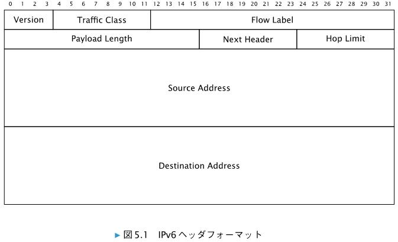

# 5.1　IPv6 ヘッダの各フィールド

* `Version` 6
* `Traffic Class` IPv4 の ToS に代わるもの
* Flow Label: 通信フロー制御に利用される予定。現時点でも不明確なものとなっている。
* Payload Length: IPv6 ヘッダは含まない長さ。（IPv6拡張ヘッダは含む）
* Next Header: IPv6 ヘッダに続くヘッダのタイプを示す。例えば、次が TCPヘッダとなるならば 6 となる。
* Hop Limit: IPv6 パケットの TTL を示す。

# 5.1.1　イーサネットの Ethernet Type フィールド
（略）

# 5.1.2　IPv4 ヘッダとの違い
（略）

