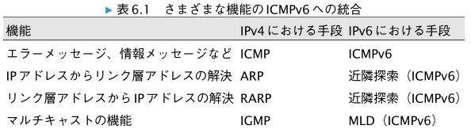
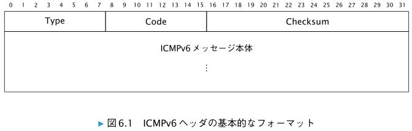
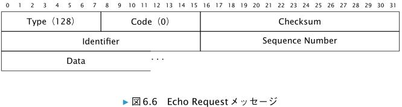

# ICMPv6

　表 6.1 に、 ICMPv6 で実現するインターネットプロトコルの制御機能と、その IPv4 における実現手段とを対比します。

# 6.1　ICMPv6 フォーマット

* Type （ 8 ビット）  
ICMPv6 メッセージの種類（ ICMPv6 タイプ）を示しています。

* Code （ 8 ビット）  
　ICMPv6 タイプごとに定義されている値です。各 ICMPv6 タイプをさらに細かく分類するた
めに用いられます。

* Checksum （ 16 ビット）  
　ICMPv6 ヘッダの Type フィールドから始まる ICMPv6 メッセージ全体と、その先頭に疑似
IPv6 ヘッダを追加したデータに対して計算したチェックサムです。 6.1.1 項を参照してくだ
さい

# 6.1.1　ICMPv6 でのチェックサム

　 ICMPv6 では IPv6 ヘッ
ダの一部を疑似 IPv6 ヘッダ（ pseudo-header 、図 5.5 参照）という形で含め、 ICMPv6 ヘッダ
とともにチェックサムを計算します。なぜ疑似 IPv6 ヘッダを含めた形でチェックサムを計算
するかというと、 IPv6 ヘッダ自体にチェックサムのためのフィールドが存在しないからです。
IPv4 では、 IPv4 ヘッダ自体にチェックサムのためのフィールドがあったので、 ICMP のチェッ
クサム計算で IPv4 ヘッダの情報を気にする必要はありませんでした。

# 6.1.2　2種類の ICMPv6 メッセージとメッセージタイプ

　ICMPv6 メッセージは、エラーメッセージと情報メッセージの 2 種類に大きく区別されてい
ます。
タイプ値の最上位ビットが 0 、すなわち 0 から 127 までのタイプ値はエラーメッセージに割
り当てられています。ICMPv6 の主なエラーメッセージをまとめます。

| タイプ | 名前 |
| --- | --- |
| 0 | Reserved |
| 1 | Destination Unreachable |
| 2 | Packet Too Big |
| 3 | Time Exceeded |
| 4 | Parameter Problem |
| 100 | Private Experimentation （実験用） |
| 101 | Private Experimentation （実験用） |

　タイプ値の最上位ビットが 1 、すなわち 128 から 255 までのタイプ値は情報メッセージに割
り当てられています。表 6.3 に、 ICMPv6 の主な情報メッセージをまとめます。

# 6.2　ICMPv6 エラーメッセージ

　ICMPv6 のエラーメッセージは、そのエラーを発生させたパケット本体を、 ICMPv6 エラー
メッセージのパケットが IPv6 の最小 MTU である 1280 オクテットを超えない範囲でデータ部
分に含みます。 ICMPv6 エラーメッセージに含まれるデータ部分から、そのメッセージが渡さ
れる上位プロトコルが判断されます。たとえば、 ICMPv6 エラーメッセージのデータ部分の先
頭が TCP ヘッダであれば、その ICMPv6 メッセージは TCP を処理するプロトコルスタックに手
渡されます。

　ICMPv6 エラーメッセージが発生させるトラフィックが他のトラフィックを圧迫してしまう
ことを防ぐために、 IPv6 対応しているノードは、 ICMPv6 エラーメッセージを送信するレー
トに制限をかけることが求められています。たとえば、 traceroute コマンドは Destination
Unreachable や Time Exceeded を利用していますが、必ずしも IPv6 ノードが ICMPv6 エラー
メッセージを返してくれるとは限りません。

　ICMPv6 エラーメッセージに対して ICMPv6 エラーメッセージを返すことは禁止されてい
ます。

　IPv6 マルチキャストアドレスを宛先とするパケットに対して、 ICMPv6 エラーメッセージを
送信することも禁止されています。ただし、 IPv6 マルチキャストで Path MTU discovery を行
うための Packet Too Big と、 Parameter Problem メッセージの Code 2 かつ Option Type の上
位 2 ビットが 10 の 2 つが例外として RFC 4443 に記載されています。

# 6.2.1　Destination Unreachable メッセージ

> NOTE  
> Destination Unreachable メッセージは、セキュリティ上の理由で無効化されることも
あります。

# 6.2.2　Packet Too Big メッセージ

　Packet Too Big メッセージは、ルータが送信します。 Packet Too Big メッセージは、ルータ
が転送するパケットサイズが、そのルータの出力側ネットワークインターフェースの MTU よ
りも大きいためにパケットが転送できないことを、ルータが送信者に知らせるときに利用され
ます。
　Packet Too Big メッセージは、他の ICMPv6 エラーメッセージとは異なり、 IPv6 マルチキャ
ストを宛先とするパケットに対する応答として送られることもあります。リンク層においてブ
ロードキャストアドレスおよびマルチキャストアドレスで送信されているパケットに対する応
答として ICMPv6 Packet Too Big メッセージが送られることもあります。これらは、 IPv6 マル
チキャストにおける Path MTU discovery を実現するためです。 Path MTU discovery について
は第 11 章で解説します。

# 6.2.3　Time Exceeded メッセージ

　ルータは、受け取ったパケットの Hop Limit が 0 であるか、転送に際して 1 減算した結果と
して Hop Limit の値が 0 になった場合は、そのパケットを破棄すると同時に、 Time Exceeded メッセージを
パケットに記載された送信元アドレス宛に送信します。通信経路を調べるときなどに使われる traceroute コマンドでは、この
仕様を利用しています。
　ノードは、最初のフラグメントを受け取ってから 60 秒以内にパケットの再構成に必要なす
べてのフラグメントを受け取れない場合には、 Code フィールドの値を 1 に設定した Time
Exceeded メッセージをパケットに記載された送信元アドレス宛に送信します。これは、 RFC
8200 の section 4.5 で規定されている仕様です。

# 6.2.4　Parameter Problem メッセージ

　IPv6 ノードがパケットを処理中に IPv6 ヘッダもしくは IPv6 拡張ヘッダに問題を発見した場
合、そのパケットを破棄する必要があります。同時に、 Parameter Problem メッセージをパ
ケット送信者に送ることが推奨されています。

# 6.3　ICMPv6 情報メッセージ

　ここでは、 RFC 4443 で定義されている 2 つの ICMPv6 情報メッセージである ICMPv6 Echo
Request メッセージと Echo Reply メッセージについてだけフォーマットを紹介します。マル
チキャストに関連する ICMPv6 情報メッセージは 12.5.1 項で、近隣探索プロトコルに関連する
ICMPv6 情報メッセージについては第 7 章で解説します

# 6.3.1　ICMPv6 Echo Request メッセージと Echo Reply メッセージ

* Type
　Echo Request メッセージの場合は 128 、 Echo Reply メッセージの場合は 129 を指定します。

* Code
　Code フィールドの値は、 Echo Request メッセージも Echo Reply メッセージも常に 0 であ
り、受信側では無視されます。

* Checksum  
　ICMPv6 ヘッダの Type フィールドから始まる ICMPv6 メッセージ全体と、その先頭に疑似
IPv6 ヘッダを追加したデータに対して計算したチェックサムです。 6.1.1 項を参照してくだ
さい。

* Identifier
　Echo Reply メッセージと Echo Request メッセージの対応関係を明示するために使う識別子
です。 0 でもかまいません。

* Sequence Number
　Echo Reply メッセージと Echo Request メッセージの対応関係を明示するために使うシーケ
ンス番号です。 0 でもかまいません。

* Data （可変長）  
　Echo Request メッセージには任意のデータを含めることができます。対応する Echo Reply
メッセージでは、そのデータをそのままコピーして返します。

　Echo Reply メッセージでは、 Echo Request メッセージに記載されている識別子、シーケン
ス番号、データをそのまま返します。 Echo Request メッセージの送信側は、受け取った Echo
Reply メッセージに記載されている情報を確認することで、どの Echo Request メッセージが
宛先ノードに到達したのかを確認できるという仕組みです。

