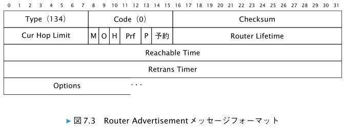
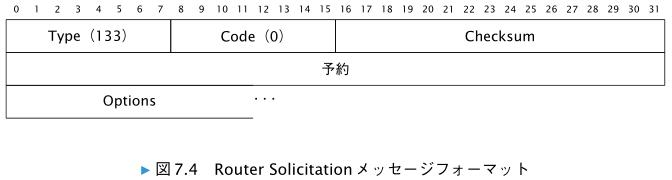

# 近隣探索プロトコル

　ICMPv6 を用いて実現される近隣探索プロトコル（ Neighbor Discovery Protocol ）は、 IPv6
の根幹となる非常に大きな特徴であある。

# 7.1　近隣探索プロトコルの機能と利用するメッセージ

　RFC 4861 では、近隣探索プロトコルが提供する機能を以下のように要約しています。

```
・リンク上のルータを探す機能（ Router Discovery ）  
・ルータを経由せずに到達できる IPv6 アドレスの範囲を知る機能（ Prefix Discovery ）  
・リンクの MTU などの情報を知る機能（ Parameter Discovery ）
・インターフェースに対してステートレスにアドレスを振る機能（ Address Autoconfigura-
tion ）
・IPv6 アドレスからリンク層のアドレスを解決する機能（ Address Resolution ）
・宛先アドレスをもとに、次にパケットを送出すべき IPv6 アドレスを知る機能（ Next-hop
Determination ）
・近隣ノードに到達できなくなったことを知る近隣不到達性検知 （ Neighbor Unreachability
Detection ）
・利用するアドレスが他のノードで使われていないかを確認する機能（ Duplicate Address
Detection ）
・ルータからホスト † 3 へ、より適切な送出先を伝える方法（ Redirect 
```

　上記の機能を実現するために、近隣探索プロトコルでは、次の 5 つの ICMPv6 メッセージを
組み合わせて利用します。
```
・Router Advertisement メッセージ（ 7.2.1 項）
・Router Solicitation メッセージ（ 7.2.2 項）
・Neighbor Solicitation メッセージ（ 7.3.1 項）
・Neighbor Advertisement メッセージ（ 7.3.2 項）
・Redirect メッセージ（ 7.4 節）
```

# 7.2　ルータとプレフィックス情報の発見

　ルータでは、ネットワーク設定に必要な情報を含む Router Advertisement
を、定期的にマルチキャストで送信します。これにより、そのルータのサブネットに接続して
いる機器は、そのサブネットを利用した通信を行うために必要な情報を得られます。

　 Router Solicitation メッセージを送ることにより、 Router Advertisement メッセージ
を直ちに受け取ることも可能です。

# 7.2.1　Router Advertisement メッセージ

　Router Advertisement は、タイプ 134 の ICMPv6 メッセージです。

　RA を運ぶ IPv6 パケットの IPv6 ヘッダでは、送信元 IPv6 ア
ドレスに、送信に使われるネットワークインターフェースに設定されたリンクローカル IPv6
アドレスを指定する必要があります。

　Router Advertisement メッセージを運ぶ IPv6 パケットでは、 IPv6 ヘッダの宛先 IPv6 アド
レスとして、通常は全ノードマルチキャストアドレス（ ff02::1 ）を指定します。 Router
Solicitation メッセージに対する返答の場合は、 Router Solicitation メッセージに記載された
送信元 IPv6 アドレスを指定します。

　前述したように、 Router Advertisement メッセージを運ぶ IPv6 パケットでは、 IPv6 ヘッ
ダの Hop Limit の値を 255 にします。これにより、他のリンクに接続された機器から誤って
Router Advertisement メッセージが転送されてきても、その内容に影響されないようにでき
ます。



* Cur Hop Limit  
　そのルータを通じて転送されていく IPv6 パケットの Hop Limit フィールドについて、ルー
タが推奨する値を示します。値は 8 ビットの符号なし整数で指定します。ルータによって特に推奨値を指定しない場合は、 0 にします。

| ビット位置 | 記号 | 意味 |
| --- | --- | --- |
| 40 | M | 「 Managed address configuration 」を意味するフラグです。 DHCPv6 による IPv6 アドレス設定が利用可能であることを示すためのフラグです。 DHCPv6 による IPv6 アドレス設定が利用可能である場合に、このフラグが 1 に設定されます。|
| 41 | O | 「 Other configuration 」を示すフラグです。 IPv6 アドレス以外の情報を DHCPv6 で取得することが可能である場合は、このフラグを 1 に設定します。たとえば、 DNS に関連する情報が DHCPv6 で提供されている場合には、このフラグを設定します。 |  
| 42 | H | 「 Mobile IPv6 Home Agent 」を示すフラグです。 RFC 3775 で定義されています。|
| 43 | Prf | 「 Default Router Preference 」を示すフラグです。 RFC 4191 で定義されています。 |
| 45 | P | 「 Neighbor Discovery Proxy 」を示すフラグです。 RFC 4389 で定義されています。 |
| 46 | - | 予約 |
| 48 | Router Lifetime | 自分がデフォルトルータとして有効な期間をホストに伝えるためのフィールドです。 16ビットの符号なしの整数により、秒単位で指定します。このフィールドの値が 0 である場合は、自身をデフォルトルータとして利用してはならないことをホストに対して示します |
| 64 | Reachable Time | 近隣不到達性検知アルゴリズムで使われるフィールドです。 32 ビットの符号なしの整数です。単位はミリ秒です。 0 は、このルータでは未定義という意味を持ちます。 |
| 96 | Retrans Timer | ホストに対して Neighbor Solicitation メッセージの再送信まで待つべき時間を指定するフィールドです。ミリ秒単位で 32 ビットの符号なしの整数を指定します。 0 は、そのルータでは未定義という意味を持ちます。 |

*  Options （可変長）  
　近隣探索メッセージのためのオプション（ 7.5 節で説明します）を含めるフィールドです。
Router Advertisement メッセージに含められるのは、 RFC 4861 で定義されている Source
Link-layer Address オプション（ 7.5.2 項） 、 MTU オプション（ 7.5.5 項） 、 Prefix Information オプション（ 7.5.3 項）のほか、 RFC 8106 † 8 で定義されている RDNSS オプション（ 7.5.6
項） 、 DNSSL オプション（ 7.5.7 項）などです。

　RFC 4861 では、RA に含まれるフラグは M と O のみであり、
残りの 6 ビットが予約（ Reserved ）と定義されています。そして、その予約フィールド内の
値として 0 を設定するように求めています。しかし、 RFC 3775 で H フラグが定義され、また
RFC 4191 で Prf として 2 ビットが使われることになっており、さらに RFC 4389 では P フラグ
が定義されています。

　RA に含まれるフラグについては、上記の状況を整理し、さ
らに必要な場合にフラグを拡張できるように、 Flags Expansion というオプションを定義した
RFC 5175 が発行されています。

# 7.2.2　Router Solicitation メッセージ

　IPv6 ノード側からルータに対して
Router Advertisement をただちに送信するように要求するために、 この Router Solicitation
メッセージを使います。

 IPv6 アドレスの自動設定を行うときなど、まだ IPv6 アドレスが設定されてい
ない場合には、送信元 IPv6 アドレスとして、未定義アドレス（ ::/128 ）を使うことになっています。

　Router Solicitation メッセージを運ぶ IPv6 パケットでは、 IPv6 ヘッダの宛先 IPv6 アドレス
として、通常は全ルータマルチキャストアドレス（ ff02::2 ）が使われます。

　Router Solicitation メッセージを運ぶ IPv6 パケットでは、 Router Advertisement メッセー
ジと同様に、 IPv6 ヘッダの Hop Limit の値を 255 とします。


