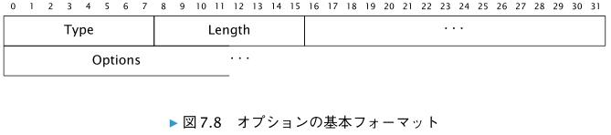

# 近隣探索プロトコル

　**ICMPv6** を用いて実現される近隣探索プロトコル（ Neighbor Discovery Protocol ）は、 IPv6
の根幹となる非常に大きな特徴であある。

# 7.1　近隣探索プロトコルの機能と利用するメッセージ

　RFC 4861 では、近隣探索プロトコルが提供する機能を以下のように要約しています。

```
・リンク上のルータを探す機能（ Router Discovery ）  
・ルータを経由せずに到達できる IPv6 アドレスの範囲を知る機能（ Prefix Discovery ）  
・リンクの MTU などの情報を知る機能（ Parameter Discovery ）
・インターフェースに対してステートレスにアドレスを振る機能（ Address Autoconfigura-
tion ）
・IPv6 アドレスからリンク層のアドレスを解決する機能（ Address Resolution ）
・宛先アドレスをもとに、次にパケットを送出すべき IPv6 アドレスを知る機能（ Next-hop
Determination ）
・近隣ノードに到達できなくなったことを知る近隣不到達性検知 （ Neighbor Unreachability
Detection ）
・利用するアドレスが他のノードで使われていないかを確認する機能（ Duplicate Address
Detection ）
・ルータからホスト † 3 へ、より適切な送出先を伝える方法（ Redirect 
```

　上記の機能を実現するために、近隣探索プロトコルでは、次の 5 つの ICMPv6 メッセージを
組み合わせて利用します。
```
・Router Advertisement メッセージ（ 7.2.1 項）
・Router Solicitation メッセージ（ 7.2.2 項）
・Neighbor Solicitation メッセージ（ 7.3.1 項）
・Neighbor Advertisement メッセージ（ 7.3.2 項）
・Redirect メッセージ（ 7.4 節）
```

# 7.2　ルータとプレフィックス情報の発見

　ルータでは、ネットワーク設定に必要な情報を含む Router Advertisement
を、定期的にマルチキャストで送信します。これにより、そのルータのサブネットに接続して
いる機器は、そのサブネットを利用した通信を行うために必要な情報を得られます。

　 Router Solicitation メッセージを送ることにより、 Router Advertisement メッセージ
を直ちに受け取ることも可能です。

## 7.2.1　Router Advertisement メッセージ

　Router Advertisement は、タイプ 134 の ICMPv6 メッセージです。

　RA を運ぶ IPv6 パケットの IPv6 ヘッダでは、送信元 IPv6 ア
ドレスに、送信に使われるネットワークインターフェースに設定されたリンクローカル IPv6
アドレスを指定する必要があります。

　Router Advertisement メッセージを運ぶ IPv6 パケットでは、 IPv6 ヘッダの宛先 IPv6 アド
レスとして、通常は全ノードマルチキャストアドレス（ ff02::1 ）を指定します。 Router
Solicitation メッセージに対する返答の場合は、 Router Solicitation メッセージに記載された
送信元 IPv6 アドレスを指定します。

　前述したように、 Router Advertisement メッセージを運ぶ IPv6 パケットでは、 IPv6 ヘッ
ダの Hop Limit の値を 255 にします。これにより、他のリンクに接続された機器から誤って
Router Advertisement メッセージが転送されてきても、その内容に影響されないようにでき
ます。


* Cur Hop Limit  
　そのルータを通じて転送されていく IPv6 パケットの Hop Limit フィールドについて、ルー
タが推奨する値を示します。値は 8 ビットの符号なし整数で指定します。ルータによって特に推奨値を指定しない場合は、 0 にします。

| ビット位置 | 記号 | 意味 |
| --- | --- | --- |
| 40 | M | 「 Managed address configuration 」を意味するフラグです。 DHCPv6 による IPv6 アドレス設定が利用可能であることを示すためのフラグです。 DHCPv6 による IPv6 アドレス設定が利用可能である場合に、このフラグが 1 に設定されます。|
| 41 | O | 「 Other configuration 」を示すフラグです。 IPv6 アドレス以外の情報を DHCPv6 で取得することが可能である場合は、このフラグを 1 に設定します。たとえば、 DNS に関連する情報が DHCPv6 で提供されている場合には、このフラグを設定します。 |  
| 42 | H | 「 Mobile IPv6 Home Agent 」を示すフラグです。 RFC 3775 で定義されています。|
| 43 | Prf | 「 Default Router Preference 」を示すフラグです。 RFC 4191 で定義されています。 |
| 45 | P | 「 Neighbor Discovery Proxy 」を示すフラグです。 RFC 4389 で定義されています。 |
| 46 | - | 予約 |
| 48 | Router Lifetime | 自分がデフォルトルータとして有効な期間をホストに伝えるためのフィールドです。 16ビットの符号なしの整数により、秒単位で指定します。このフィールドの値が 0 である場合は、自身をデフォルトルータとして利用してはならないことをホストに対して示します |
| 64 | Reachable Time | 近隣不到達性検知アルゴリズムで使われるフィールドです。 32 ビットの符号なしの整数です。単位はミリ秒です。 0 は、このルータでは未定義という意味を持ちます。 |
| 96 | Retrans Timer | ホストに対して Neighbor Solicitation メッセージの再送信まで待つべき時間を指定するフィールドです。ミリ秒単位で 32 ビットの符号なしの整数を指定します。 0 は、そのルータでは未定義という意味を持ちます。 |

*  Options （可変長）  
　近隣探索メッセージのためのオプション（ 7.5 節で説明します）を含めるフィールドです。
Router Advertisement メッセージに含められるのは、 RFC 4861 で定義されている Source
Link-layer Address オプション（ 7.5.2 項） 、 MTU オプション（ 7.5.5 項） 、 Prefix Information オプション（ 7.5.3 項）のほか、 RFC 8106 † 8 で定義されている RDNSS オプション（ 7.5.6
項） 、 DNSSL オプション（ 7.5.7 項）などです。

　RFC 4861 では、RA に含まれるフラグは M と O のみであり、
残りの 6 ビットが予約（ Reserved ）と定義されています。そして、その予約フィールド内の
値として 0 を設定するように求めています。しかし、 RFC 3775 で H フラグが定義され、また
RFC 4191 で Prf として 2 ビットが使われることになっており、さらに RFC 4389 では P フラグ
が定義されています。

　RA に含まれるフラグについては、上記の状況を整理し、さ
らに必要な場合にフラグを拡張できるように、 Flags Expansion というオプションを定義した
RFC 5175 が発行されています。

## 7.2.2　Router Solicitation メッセージ

　IPv6 ノード側からルータに対して
Router Advertisement をただちに送信するように要求するために、 この Router Solicitation
メッセージを使います。

 IPv6 アドレスの自動設定を行うときなど、まだ IPv6 アドレスが設定されてい
ない場合には、送信元 IPv6 アドレスとして、未定義アドレス（ ::/128 ）を使うことになっています。

　Router Solicitation メッセージを運ぶ IPv6 パケットでは、 IPv6 ヘッダの宛先 IPv6 アドレス
として、通常は全ルータマルチキャストアドレス（ ff02::2 ）が使われます。

　Router Solicitation メッセージを運ぶ IPv6 パケットでは、 Router Advertisement メッセー
ジと同様に、 IPv6 ヘッダの Hop Limit の値を 255 とします。


* 予約（ 32 ビット）  
　未使用領域です。このフィールドの値は 0 であることが求められます。受信側は、この
フィールドの内容を無視する必要があります。

* Options （可変長）  
　近隣探索メッセージのためのオプション（ 7.5 節）を含めるフィールドです。
Router Solicitation メッセージに含められるのは、 RFC 4861 で定義されている Source
Link-layer Address オプション（ 7.5.2 項）です。なお、送信元アドレスが未定義アドレス
の場合は、オプションを含めることが禁止されています。

## 7.2.3　ルータ側の処理

　Router Advertisement により、ルータとしてパケットを転送するネット
ワークプレフィックス情報や、デフォルトルータであるかどうかといった情報などをホストに
対して送信します。

　システムのシャットダウンするなどの理由により送信をやめる場合は、 Router Lifetime をゼロに設定し
た Router Advertisement メッセージを送信すべきとされています。

■ ルータのリンクローカルアドレスが変わる場合

　近隣探索プロトコルでは、ルータのリンクローカルアドレスを利用して、そのリンク内で
ルータを識別します。そのため、ルータのリンクローカルアドレスを変更すべきではありま
せん。

　RFC 4861 では非推奨としつつも、ルータのリ
ンクローカルアドレスが変わる場合には、ただちにその変更を通知するために、古いリンク
ローカルアドレスで Router Lifetime をゼロに設定した Router Advertisement メッセージを
いくつか送信し、 そのうえで、 新しいリンクローカルアドレスを使った Router Advertisement
メッセージを送信することが推奨されています。

## 7.2.4　ホスト側の処理

　ホストは、ルータがデフォルトルータとしての有効期限が過ぎる前に新たな Router
Advertisement メッセージによって有効期限を更新しない場合、自身の Default Router List
からそのルータに関するエントリを削除する必要があります。

# 7.3　リンク層アドレスの解決と近隣不到達性の検知

> NOTE  
> 　Neighbor Solicitation と Neighbor Advertisement は、 SLAAC で
定義されている DAD （ Duplicate Address Detection 、重複アドレス検知）でも利用さ
れます。 DAD に関しては、 8.5 節で説明します。

## 7.3.1　Neighbor Solicitation メッセージ

　Neighbor Solicitation メッセージは、リンク層アドレスの解決を行う場合にはマルチキャ
ストで送信されます。その際、 IPv6 ヘッダの宛先 IPv6 アドレスとしては、 Target Address
フィールドに指定する値に対応した Solicited-Node マルチキャストアドレス（ 12.3 節参照）を
指定することになります。

　近隣不到達性検知の場合は、対象となる IPv6 ノードを宛先とするユニキャストで送信され
ます。


* Target Address （128 ビット）  
　対象となる IPv6 アドレスです。このフィールドにマルチキャストアドレスを記載すること
は禁止されています。

* Options （可変長）  
　近隣探索メッセージのためのオプション（7.5 節で説明します）を含めるフィールドです。
Neighbor Solicitation メッセージには、 Source Link-layer Address オプションを使って、
送信者のリンク層アドレスを含めることができます。

## 7.3.2　Neighbor Advertisement メッセージ

　NA は、 NS への返答として送信されます。設定情報を更新したときに、
それを即座に伝搬させるため、IPv6 ノードが自発的に NA を送信することもあります。

　NS に返答する場合は、NS の送信元アドレスによって、返答 NA の宛先が変わります。
NS の送信元 IPv6 アドレスが未定義アドレスではない場合、そのアドレスへ NA が送信されます。

　NS 送信元アドレスが未定義アドレスである場合は、全ノードマルチ
キャスト宛に、返答 NA が送信されます。

　自発的に NA を送信する場合は、全ノードマルチキャスト宛（ ff02::1 ）に送信します。


* R ビット  
　ルータであることを示すためのフラグです。このフラグが 1 であるとき、送信元がルータで
あることを示します。

* S ビット  
　NS に対する返答であることを示します。
近隣不到達性検知では、このフラグを使います。NA の宛先がマルチキャストの場合や、
自発的なユニキャスト送信の場合は、 S フラグを 1 にすることが禁止されています。

* O ビット  
　Override を意味するフラグで、近隣キャッシュに登録されているリンク層アドレス情報の
上書きを推奨する場合には 1 に設定します。このフラグが設定されていない場合には、リン
ク層アドレスが近隣キャッシュに登録済みのエントリが NA の情報で更新されることはありません。
エニーキャストでは、このフラグを 1 にしないことが推奨されています。

* Target Address（128 ビット）  
　NS に対する返答の場合、 NS の Target Address フィールドに記載されている IPv6 アドレスになります。
リンク層アドレスの変更を伝える自発的な NA の場合は、このフィールド
に、変更のあったリンク層アドレスに対応する IPv6 アドレスが入ります。 Target Address
フィールドをマルチキャスト IPv6 アドレスにすることは禁止されています。

* Options（可変長）  
　近隣探索メッセージのためのオプション（ 7.5 節で説明します）を含めるフィールドです。

## 7.3.3　Solicited-Node マルチキャストグループへの参加

　内容なし

## 7.3.4　Neighbor Solicitation と Neighbor Advertisement の送受信

　 IPv6 アドレスからリンク層アドレスへの対応は、近隣キャッシュ（ Neighbor Cache ）
として、各ノードで管理している。

　近隣キャッシュに対応する IPv6 アドレスのリンク層アドレスがなければ、ノードは NS を送信する。
この NS を送信する IP パケットの宛先 IPv6 アドレスは、ネットワークインターフェースがマルチキャスト
利用可能なものであれば、 Solicited-Node マルチキャストアドレスとなる。

　NS による問い合わせがあると、該当する IPv6 アドレスが設
定されているネットワークインターフェースを持つノードは、ユニキャストで NA メッセージを返信する。
この NA を受け取り、リンク層アドレスの解決を行う。

　あるノードが NS 送信し、NA を受け取るまでの流れは次のようになる。

　ノードでは、リンク層アドレスがわからない IPv6 パケットの送信をトリガーとして、
NS を送信する。トリガーとなった IPv6 パケットはキューに保存する。
NS を送信すると同時に、該当する IPv6 アドレスのためのエントリを近隣キャッシュに生
成する。リンク層アドレスはわからない状態なので、このエントリは「 INCOMPLETE （不完全） 」とする。
NA を受け取ったら、受け取った情報で近隣キャッシュを更新する。

　ホストごとに設定された時間だけ待っても NS に対して応答がない場合、NSを再送する。
一定の回数だけ再送しても NA を受け取れない場合は、キューに保存していた IPv6 パ
ケットに対して ICMP Destination Unreachable メッセージを Code 3 （ Address Unreachable ）
で返す。

## 7.3.5　近隣不到達性検知

　近隣不到達性検知には、次の 2 種類があります。

* 上位層のプロトコルにおける応答  
　たとえば TCP で通信相手のノードからACK を受け取った場合が挙げられます。

* NS に対する NA の応答
　NA の S フラグが 1 に設定されていれば、 こちらから送った NS が相手に届いたことに対する応答だとわかる。
S フラグが 0 に設定されている NA を受け取ったりしても、それ
らの近隣探索メッセージの送信元ノードへの到達性を確認するものとみなされない。
「自ノードから」次ホップとなる近隣ノードへ到達性を重要視する。

> NOTE  
> 近隣不到達性検知は、ユニキャストで IPv6 パケットを送信するときに同時に実施され
るものです。宛先がマルチキャストアドレスの場合には実施されません。

## 7.3.6　近隣キャッシュのステート

　近隣キャッシュは、以下の 5 種類の state を持つ。

* INCOMPLETE  
　Solicited-node マルチキャストアドレスに対し
て NS メッセージが送信され、NA の応答が受け取れていないときに、このステートになる。
NA を一度も受け取っていない状態と考えるとよい。

* REACHABLE  
　決められた時間内に、近隣ノードへの到
達性が肯定的に確認できる通知を受け取れているとき、そのノードに対応するエントリのス
テートは REACHABLE にななる。

* STALE  
　該当するエントリに対応する近隣ノードは到達可能とはいえないことを示しています。近隣ノード
への到達性を肯定的に確認できる通知を受け取ってから所定の時間（ ReachableTime ）が
経過すると、そのノードに対応するエントリのステートは STALE になります。ステートが
STALE になっても、次にパケットが送信されるまでは、近隣探索プロトコルとしての処理は
特に何も起きません。

* DELAY  
　近隣ノードへの到達性を肯定的に確認でき
る通知を受け取ってから所定の時間（ ReachableTime ）が経過してしまったが、送信済みの
パケットがあるので、それを待機している期間であることを示している。該当するエント
リに対応する近隣ノードは到達可能とはいえないが、送出済みのパケットがあるので、上位
層を通じて肯定的な確認が得られる可能性を考慮して待っている状態となる。
　送信済みパケットの通知を待機する期間（通知を待つ時間とは別に決められています）に近
隣ノードへの到達性を示す肯定的な確認が得られたら、 REACHABLE に移行します。得られ
ない場合は、NS を送信したうえで PROBE へと移行します

* PROBE  
　到達性を確認する応答を待っている状態です。ノードに設定されている NS の再送
タイマーごとに NS が再送信されます。

　IPv6 パケットの送信時にリンク層アドレスがわからない場合、近隣キャッシュに INCOMPLETE のエントリを生成しま
す。このエントリは、リンク層アドレスの解決に成功すれば REACHABLE に変わり、
リンク層アドレスの解決に失敗した場合はエントリごと削除します。 INCOMPLETE か
ら REACHABLE への遷移は、NS の応答として NA を受け取った場合のみ。

　エントリが STALE 、 DELAY 、 PROBE のときに、近隣ノードへの到達性が確認
された場合には、ステートが REACHABLE に変わります。 STALE 、 DELAY 、 PROBE の各ステー
トから REACHABLE への遷移では、 INCOMPLETE からの場合とは違い、上位層での確認によ
る場合がある。

> 近隣不到達性検知における ReachableTime  
　近隣不到達性検知では、近隣ノードへの到達性を肯定的に確認できる通知を受け取っ
てから、ある所定の期間（ReachableTime、ミリ秒）だけ、そのノードが到達可能である（ Reachable ）であるとみ
なします。

　ReachableTime としては、RA の Reachable Time の値をもとに算出することが推奨されています。具体的には、このフィールド
の値が 0 でない場合、その値に対してノード内で生成されたランダムな数値をかけたも
のを ReachableTime として利用することが推奨されています（RA が 0 の場合などに使うデフォルト値も規定されています）。
ReachableTime は、新しく受け取った RA で ReachableTime が変化した場合には再計算されます。
RA の Reachable Time フィールドに変化がない場合でも、数時間おきにノード内の
ReachableTime の再計算を行うことが推奨されています。

# 7.4　Redirect メッセージ

　Redirect は、他のルータが特定の経路としてより良い次
ホップであることを **ルータからホストに対して伝えると** きや、**特定の宛先が実際には同一リン
ク上に接続された近隣ノード** であることを伝えるときに使われる。

　送信元 IPv6 アドレスは、 Redirect が送信されるネットワークインターフェースのリンクローカルアドレスである必要がある。

　宛先 IPv6 アドレスは、ルータが Redirect を送信するきっかけとなったパケットの送信元 IPv6 アドレスとなる。


* Target Address （ 128 ビット）  
　より良い次ホップの IPv6 アドレス。

　Redirect を送信するきっかけとなっ
た宛先 IPv6 アドレスが近隣ノードである場合、Target Address と Destination
Address が同じにものになる。

 より良い次ホップとしてルータを示す場合は、Target Address をリダイレクト先となるルータのリンクローカルアドレスにする。

* Destination Address （ 128 ビット）  
　リダイレクト先を通じて転送されるべき宛先 IPv6 アドレス。

*  Options （可変長）  
　オプションを含むためのフィールド。

## 7.4.1　無効な Redirect メッセージ

以下の要素を満たさない Redirect メッセージは無効なものとして破棄されます。
 * ICMPv6 メッセージの IPv6 ヘッダに記載された送信元 IPv6 アドレスがリンクローカルア
ドレスであること
* ICMPv6 メッセージの IPv6 ヘッダの Hop Limit の値が 255 であること（ルータによって転
送された Redirect メッセージは 255 よりも小さな値になってしまう）
* ICMP Code が 0 であること
* そのメッセージを受け取ったノード内の経路表において、宛先と次ホップが ICMPv6
Redirect メッセージにある内容と整合性が取れていること
* ICMP Destination Address フィールドにマルチキャストアドレスが含まれていないこと
* ICMP Target Address がリンクローカルアドレス、もしくは、 ICMP Destination Address
の内容と同じものであること
* ICMPv6 メッセージに含まれるすべてのオプションが 0 よりも大きなサイズであること

# 7.5　近隣探索メッセージのオプション

　RFC 4861 で定義されている近隣探索（RS, RA, NS, NA）には、 0 個以上のオプションを含めることができま
す。


## 7.5.1　近隣探索メッセージのオプションの基本フォーマット



* Type （ 8 ビット）  
　表 7.1 の Type番号。

*  Length （ 8 ビット）  
　Type フィールドと Length フィールドを含めたオプション全体を 8 オクテット単位で示す。
0 を指定することは禁止されている。

　RFC 4861 では、オプションが 64 ビット境界で終端するように、必要に応じてパディングす
ることが推奨されている。

## 7.5.2　Source Link-layer Address オプションと Target Link-layer Address オプション

　Source Link-layer Address オプションには、パケット送信者のリンク層アドレスを含めま
す。NS、RS、RA で利用されるオプション。

　Target Link-layer Address オプションには、メッセージの対象となるノードのリンク層ア
ドレスを含めます。NA と Redirect メッセージで利用される
オプションです。


* Type （ 8 ビット）  
　Source Link-layer Address オプションの場合は 1 、 Target Link-layer Address オプション
の場合は 2 です。

* Length （ 8 ビット）  
　オプション全体の長さを 8 オクテット単位で示します。**リンク層がイーサネットの場合、こ
のフィールドの値は 1 になります。**

* Link-layer Address （可変長）  
　リンク層アドレスを格納するためのフィールドです。このフィールドの長さはリンク層の種
類によって変わります。

　RFC 2464 に、 リンク層がイーサネットである場合の Target Link-layer Address オプショ
ンの例が紹介されています。図 7.10 のように、 48 ビット（ 6 オクテット）の IEEE 802 アドレ
スが Type と Length フィールドの直後に続きます。


## 7.5.3　Prefix Information オプション

　Prefix Information オプションは、 on-link プレフィックスを広告するためのもので、
RA のみで利用されます。


* Length （ 8 ビット）  
　オプション全体の長さを 8 オクテット単位で示します。 Prefix Information オプションの長
さは、 Type フィールドと Length フィールドを含めて 32 オクテットなので、このフィール
ドの値は 4 になります。

* Prefix Length （ 8 ビット）  
　プレフィックス長で 0 から 128 の値をとります。

* L （ 1 ビット）  
　on-link のアドレスであることを示すフラグです（ 7.6.1 項参照） 。

* A （ 1 ビット）  
　ホストに対し、GUA を SLAAC によって設定するように伝える
ためのフラグです。ホストは、このフラグが 1 に設定されているとき、このオプションを含
む RA によって示すプレフィックスの値と、ホストが生成す
るインターフェース識別子を組み合わせて、グローバルユニキャストアドレスを生成できます。

* Valid Lifetime （ 32 ビット）  
　このプレフィックスがリンク上で有効となる時間を秒単位で示す、 32 ビットの符合なし整
数です。 32 ビットすべてが 1 である場合、無期限であるであることを示します。

* Preferred Lifetime （ 32 ビット）  
　SLAAC によって生成されたアドレスが推奨される時間を秒単位で示す、 32 ビットの符合な
し整数です。 Valid Lifetime を超えない値であることが求められます。

* Prefix （ 128 ビット）  
　IP アドレスもしくは IP アドレスのプレフィックスです。

## 7.5.4　Redirected Header オプション

　Redirected Header オプションは、 Redirect を誘発する原因となったパケットの
全部もしくは一部を示すために利用されます。このオプションは、 Redirect でのみ
利用されます。


* Length （ 8 ビット）  
　オプション全体の長さを 8 オクテット単位で示します。

* IP header + data （可変長）  
　Redirect メッセージを誘発する原因となったパケットの全部もしくは一部です。 Redirect
メッセージの全長が IPv6 の最小 MTU （ 1280 オクテット）を超えない範囲で、原因となった
パケットを切り詰めて格納します。

## 7.5.5　MTU オプション

　RA 以外でこのオプションが使われることはありません。


* Length （ 8 ビット）   
　オプション全体の長さを 8 オクテット単位で示します。 MTU オプションの長さは、 Type
フィールドと Length フィールドを含めて 8 オクテットなので、このフィールドの値は 1 に
なります。

* MTU  
　リンクで推奨される MTU です。 32 ビットの符合なし整数で指定します。

## 7.5.6　RDNSS （ Recursive DNS Server ）オプション

　RFC 6106 の RDNSS オプションと DNSSL オプションは、RA のオプションに含められます。


* Length （ 8 ビット）  
　オプション全体の長さを 8 オクテット単位で指定します。キャッシュ DNS サーバの IPv6 ア
ドレスが 1 つであれば、 Type フィールドと Length フィールドを含めた RDNSS オプション
の長さは 24 オクテット（64 bits + 128bits）なので、 Length フィールドの値は 3 になります。キャッシュ DNS
サーバの IPv6 アドレスが 1 つ増えるごとに、このフィールドの値は 2 ずつ大きくなります。

* Lifetime （ 32 ビット）  
　このオプションが示す DNS サーバを使ってもよい期間を秒単位で示す、 32 ビットの符合な
し整数です。すべてのビットが 1 （ 0xffffffff ）であれば、無期限であることを示します。
0 は記載されたキャッシュ DNS サーバをそれ以降使用してはならないことを示します。

* Address of IPv6 Recursive DNS Servers （可変長）
　DNS サーバの IPv6 アドレスです。このフィールドに含まれる IPv6 アドレスの数は、 Length
フィールドの値から求めます。

　1 つの RDNSS オプションで、複数のキャッシュ DNS サーバ IPv6 アドレスに対する個別の
Lifetime を表現することはできません。しかし、 1 つの Router Advertisement メッセージに、
それぞれ Lifetime が異なる複数の RDNSS オプションを添付することは可能です。

## 7.5.7　DNSSL （ DNS Search List ）オプション

　DNSSL は、 DNS suffix search list を提供するためのオプションです。たとえば http:
//www/ としたときに、 DNSSL オプションに example.com が設定されていれば、自動的に
http://www.example.com/ であると解釈されたうえで処理されます。


*  Length （ 8 ビット）  
オプション全体の長さを 8 オクテット単位で示します。このフィールドの値は、 Domain
Names of DNS Search List フィールドの長さに応じて変わります。最小値は 2 です。

* Lifetime （ 32 ビット）  
　このオプションが示す DNS サーバを使ってもよい期間を秒単位で示します。値の意味は
RDNSS オプションと同様です。

* Domain Names of DNS Search List （可変長）  
　1 つ以上のドメイン名を含めます。各ドメイン名は、 RFC 1035 の Section 3.1 に記載され
たフォーマットです。 17.3.2 項で解説しているフォーマットと同じです。

> NOTE　DNS suffix search list が抱えるセキュリティ上の問題  
　DNS suffix search list には、まったく異なる FQDN へ誘導されるというセキュリティ上の問題があります。
この攻撃によって、例えばスワードや電子メールのような情報が盗まれる可能性が考えられます。  
　この問題は、 IPv4 における DHCP にも同様に存在します。 IPv4 の DHCP における
DNS suffix search list のオプションを規定した RFC 3397 では、このような攻撃は
DNSSEC でも防げないと明記されています。これは、 suffix が追加されるのが DNS 問い
合わせの時点であるため、 DNSSEC の保護の対象外となるためです。  
　なお、不正な RA によるセキュリティ上の問題は、
DNSSL に限りません。RA に関連するセキュリティに関
しては、 15.4 節をご覧ください。

# 7.6　IPv6 における on-link と off-link

　同一リンクに接続されていることを on-link、同一リンクに接続されていないことを
‌off-link と表現することがあります。 IPv6 と IPv4 では、サブネットに対する on-link と off-link のモデ
ルが異なります。 IPv6 で自動的に on-link
であると判定可能なのは、リンクローカルアドレスのみなのです。

　図 7.16 のような、 2 つのルータと 2 つのホストからなるネットワークがあるとし
ます。ホスト A とホスト B が 2 台の機器が接続されているリンクは、それぞれ別々のネット
ワークプレフィックス 2001:db8::/64 と 3ffe::/64 を Router Advertisement メッセージ
によって広告しているルータ 1 とルータ 2 によって同時に運用されています。


　ホストA から ホストB に対する通信でルータを経由する必要は
特にありません。 2001:db8::a と 3ffe::b は同一のリンクに接続しているからです。この場
合、ホスト A にとって、ホスト B のネットワークインターフェースに設定されている 3ffe::
b は on-link であり、 on-link のノードに対してはルータを経由させずにパケットを届けること
ができるはずです。 IP アドレスのネットワークプレフィックスが違うというだけでホスト B
が off-link であると自動的に判定してしまうと、リンク層ではルータにパケットを転送しても
らうような送信方法を採用してしまうでしょう。 on-link であるノードに対して直接パケット
を送信するには、宛先となる IPv6 アドレスが on-link なのか off-link なのかを判断することが
IPv6 では重要な問題になるのです。
